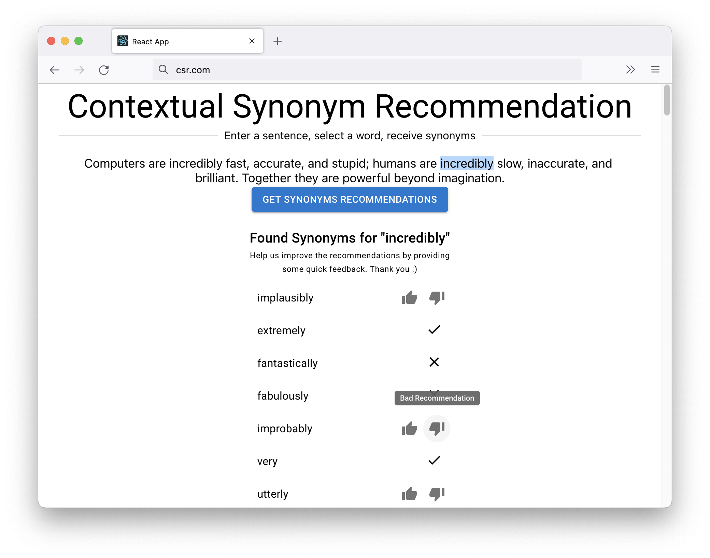
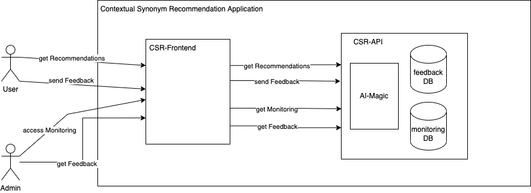
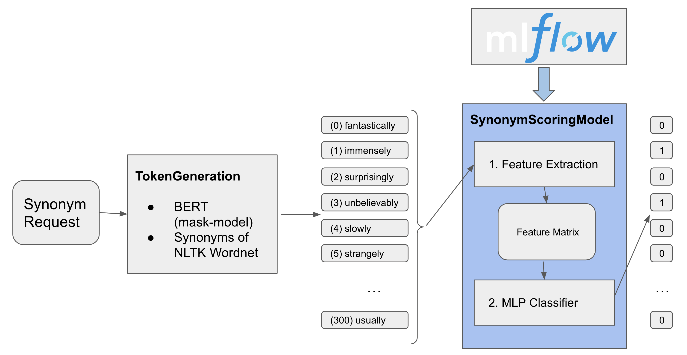
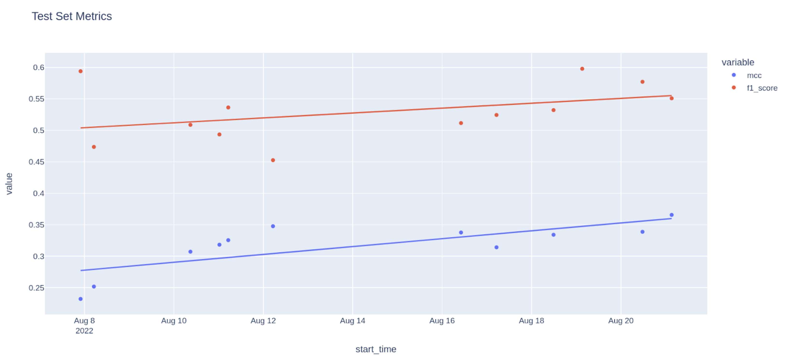
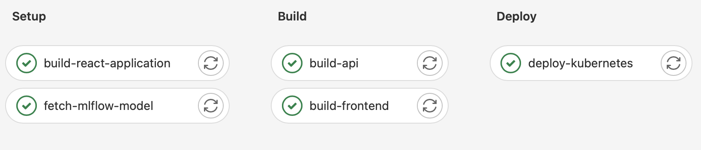
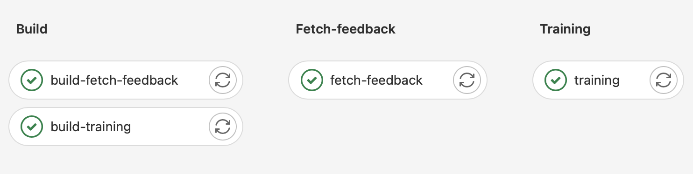
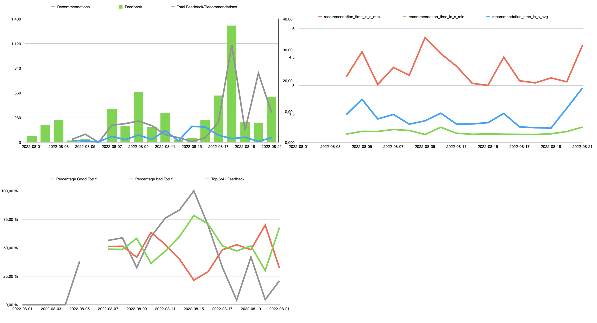

# Contextual Synonym Recommendation


  - [Introduction](#introduction)
  - [Requirements](#requirements)
  - [Architecture](#architecture)
    - [Basic Overview](#basic-overview)
    - [Deployment Infrastructure](#deployment-infrastructure)
    - [Important Functionalities](#important-functionalities)
      - [Synonym Recommendation](#synonym-recommendation)
      - [Data](#data)
      - [Synonym Scoring Model](#synonym-scoring-model)
        - [Feature Extraction](#feature-extraction)
        - [Model Training](#model-training)
      - [Feedback Loop & Training Schedule](#feedback-loop--training-schedule)
  - [Development](#development)
    - [API](#api)
      - [Fetch model / Use different model](#fetch-model--use-different-model)
    - [Frontend](#frontend)
    - [Model](#model)
    - [Training](#training)
    - [Data](#data-1)
      - [Dataset Generation](#dataset-generation)
      - [1) Score BERT suggestions sorted by word2vec similarity](#1-score-bert-suggestions-sorted-by-word2vec-similarity)
  - [Deployment](#deployment)
    - [Overview](#overview)
    - [Pipeline](#pipeline)
    - [Monitoring](#monitoring)
## Introduction
The name says it all. This project recommends synonyms for a single word based on the context of the surrounding sentences. 
The goal was to develop an AI model and bring it into production thereby learning all the necessary steps needed to successfully deploy AI applications. 

This project was part of the _Software Engineering for AI Systems_ lecture by [Prof. Dr. Norbert Siegmund](https://twitter.com/norbsen) at the University of Leipzig and was developed with [@dhelmr](https://github.com/dhelmr).


|  Technologies	|   	|   	|   	|   |
|:---:	|:---:	|:---:	|:---:	| :-:  |
| Kubernetes   	|  CI/CD 	|  gensim 	|  DVC 	| huggingface |
|  MLFlow 	| React  	| FastAPI   	|  SQLite 	| NLTK |

## Requirements

* The system should be able to recommend synonyms based on the context of the sentence. 
* In the beginning, it only needs to understand the English language. 
* But the architecture should not exclude different popular western languages.
* The user needs to be able to retrieve recommendations appropriately. 
* This should be realized with a web UI. In further iterations, a standalone API for accessing the recommendation service should be possible.
* In addition to the UI, the synonym recommendation should be accesible through an REST API.
* The target user should be the everyday person wanting to improve their writing.  (e.g. writing letters or emails to friends, sending a business message, or formulating a blog post)
* The initial training data should consist of typical English sentences, a selected word, a synonym suggestion, and a score if the suggested word is a synonym.
* The users should be able to give feedback on the recommended synonyms and the feedback should be used regularly to retrain the model.
* The processing of an input sentence should be quick, i.e. not take longer than 5 seconds. 
* There should be a high degree of correctly suggested synonyms (high precision).
* It should be possible for an developer/administrator to compare models and quickly be able to load a different version of the model.


## Architecture 
### Basic Overview


The application consists of two main parts. The _API_ and the _Frontend_ (FE). 
The Frontend is a simple React application that sends REST requests to the API.
Allowing the user to retrieve synonym recommendations and provide feedback on those recommendations. 
The API is developed with the FastAPI framework. It is responsible for recommending synonyms, storing feedback, and monitoring the prediction performance.

### Deployment Infrastructure
The application gets deployed on a Kubernetes cluster. 
Both the API and FE are a service in the cluster. The FE is a Flask server that serves the static React page. The FE is served on its own, and not via the API, because in case the API goes down, the FE will still be available and able to inform the user about the current API issue.

The API stores user feedback and monitoring logs into a SQLite DB which is stored on a Persistent Volume inside the cluster.

Each commit to the main branch triggers a pipeline inside gitlab and does the following: 
* Setup
  * builds the React application and stores the new files in the pipeline cache
  * fetches the latest production model from MLFlow and stores it in the pipeline cache
* Build
  * builds the API container and pushes it to docker hub registry
  * builds the web container (FE) and pushes it to docker hub registry
* Deploy
  * updates the kubernetes services to the newest image version 

Additionally, there is a scheduled job running once a day and triggering the following steps:

1. Fetch the last day's user feedback from the backend and adds it via `dvc` to datasets/feedback.csv. 
2. Re-Train the model in kubernetes using the newly fetched feedback. If the new model is better (i.e. achieves a better precision and f1-score on the test set), it is flagged as "production" in mlflow.
3. Commit a git tag for triggering the setup-build-deploy pipeline of the backend and frontend (see above).

All configurable variables and credentials (e.g. for mlflow, dvc, docker, kubernetes, git ssh key, etc.) needed within the CI/CD pipelines are injected as Gitlab Environment Variables.

### Important Functionalities
#### Synonym Recommendation


The recommendation of synonyms happens in three steps: 

1. Generate a list of possible replacement tokens for the word in question using [BERT](https://huggingface.co/bert-base-uncased) and synonyms from nltk's wordnet.
2. Score each of these tokens using a `SynonymScoringModel`. It takes as input the original word to be replaced, its context and the suggested replacement and outputs whether the replacement is a suitable synonym.
3. Filter all tokens which are classified as a synonym in step 2 and sort them by the model's confidence.

While the token generation from step 1 is implemented as a fixed heuristic, step 2 employs a ML model. Therefore, the focus for the training, data collection, and improving the model's performance lies foremostly in this step.

#### Data
Due to the lack of an available dataset containing both synonyms and their context, we produced all data for this project on our own. The dataset used for building the synonym scoring is structured as follows:

1. `datasets/training.csv` contains manually-labelled data used for training the model.
2. `datasets/feedback.csv` contains user data fetched from the feedback database. It gets updated regularly and is also used for training the model.
3. `datasets/test.csv` contains manually-labelled data and is used for validating a trained model. All metrics we use for comparing different models are calculated on this data.

The repository furthermore provides a text file `datasets/en_long.txt` containing english sentences with a minimum length of 100 characters from [tatoeba.org](https://tatoeba.org) that is can be used for the manual labeling process. 

The csv datasets are stored using `dvc` in a MinIO instance.

#### Synonym Scoring Model 
The `SynonymScoringModel` consists of a feature extractor generating numerical features from the raw input text and the actual binary classification model. For the latter, scikit's [MLPClassifier](https://scikit-learn.org/stable/modules/generated/sklearn.neural_network.MLPClassifier.html) is employed. 

As the synonym recommendation happens completely on-line (i.e. no data can be pre-computed), particular attention must be directed towards the speed of both the feature extraction and classification.   

##### Feature Extraction
The feature extractor loads a word2vec model from `gensim`, a sentence embedding model from [SBERT](https://pypi.org/project/sentence-transformers/) and [nltk](https://www.nltk.org/) functionalities.  The following features can be generated:

|  Feature Name	| Meaning |	
|:---:	|:--:|
W2V_HAS_ORIGINAL | 1 if the original token is present in the word2vec model, 0 if not |
W2V_HAS_REPLACEMENT | 1 if the replacement token is present in the word2vec model, 0 if not |
W2V_SIM_ORIGINAL_REPLACEMENT | word2vec cosine similarity between the original and replacement token | 
W2V_SIM_WINDOW_8_ORIGINAL | word2vec cosine similarity between the original token and the mean of the eight tokens surrounding it | 
W2V_SIM_WINDOW_4_ORIGINAL | word2vec cosine similarity between the original token and the mean of the four tokens surrounding it | 
W2V_SIM_WINDOW_2_ORIGINAL | word2vec cosine similarity between the original token and the mean of the two tokens surrounding it | 
W2V_SIM_MEAN_ORIGINAL | word2vec cosine similarity between the original token and the mean of all the sentence's tokens | 
W2V_SIM_MEAN_REPLACEMENT | word2vec cosine similarity between the replacement token and the mean of all the sentence's tokens |
W2V_SIM_WINDOW_8_REPLACEMENT| word2vec cosine similarity between the replacement token and the mean of the eight tokens surrounding it | 
W2V_SIM_WINDOW_4_REPLACEMENT | word2vec cosine similarity between the replacement token and the mean of the four tokens surrounding it | 
W2V_SIM_WINDOW_2_REPLACEMENT | word2vec cosine similarity between the replacement token and the mean of the two tokens surrounding it | 
W2V_SIM_MEAN_DIFF | word2vec cosine similarity between the difference of the original and replacement token and the mean of all the sentence's tokens | 
W2V_DIFF | Difference of the original and replacement word2vec vector (1 feature per vector element) |
W2V_ORIGINAL | word2vec vector of the original token  (1 feature per vector element) |
W2V_REPLACEMENT | word2vec vector of the replacement token  (1 feature per vector element) |
W2V_SIM_NN | cosine similarity between the replacement and the mean of all noun tokens in the sentence (tagged with NLTK) |
W2V_SIM_VB | cosine similarity between the replacement and the mean of all verb tokens in the sentence (tagged with NLTK) |
W2V_SIM_ADJ | cosine similarity between the replacement and the mean of all adjective tokens in the sentence (tagged with NLTK) |
SBERT_SIM_ONLY_TOKENS | SBERT cosine similarity of the original and replacement token |
SBERT_SIM_WINDOW_2 | SBERT cosine similarity between the original and replacement with a window of length 2 | 
SBERT_SIM_WINDOW_4 | SBERT cosine similarity between the original and replacement with a window of length 4 | 
SBERT_SIM_WINDOW_8 | SBERT cosine similarity between the original and replacement with a window of length 8 | 
SBERT_SIM_WHOLE_SENTENCE  | SBERT cosine similarity between the original and replacement sentence |
WORDNET_IS_IN_SYNS  | 1 if the replacement token is a synonym in nltk's wordnet, 0 if not | 
WORDNET_IS_IN_ANTONYMS | 1 if the replacement token is a antonym in nltk's wordnet, 0 if not | 
WORDNET_NUMBER_SYNSETS |the number of synsets for the original token in nltk's wordnet | 
NLTK_POS_CAT | one-hot encoding of the part-of-speech category of the original token (categories: `NN*, VB*, ADJ*, other`; tagged with NLTK) | 


##### Model Training

The model training is performed as a cross-validated grid search trying out different parameter combinations for the MLPClassifier.
The best model regarding the cross-validated loss is selected. Using this model, a set of binary-classification metrics is calculated on the **test** set. Out of these, the most important are:

* Precision
* Recall
* f1-score
* [MCC](https://en.wikipedia.org/wiki/Phi_coefficient)

As the test set is disbalanced, accuracy should be interpreted accordingly.

Furthermore, the time for the complete scoring of the test set is stopped and used for calculating the metric `latency_per_sentence`, which is the time
the scoring model needs per individual sentence for both the feature extraction and binary classification. 

The model together with its metrics and parameters is then pushed to mlflow, where different versions can be compared to each other. It should be noted that the test set should be kept constant in order to not distort a comparison between different model versions. 

#### Feedback Loop & Training Schedule
It is very important to receive user feedback on the model predictions. 
This helps to monitor if the model is performing on real-world tasks as expected from the training and test results and thus indicating for example if a potential data drift is occurring. 
User feedback is also very valuable because it acts as new _real_ training data.
To be able to use this feedback the UI is designed to let the user quickly and easily provide feedback if the recommendation was a valid synonym or not. 

The feedback is then stored inside a SQLite DB on the kubernetes cluster. 
Before each new training, the current feedback gets added to the training data and the newly trained model gets pushed to the MLFlow registry with all parameters from training and all metrics from testing. 
If the new model performs better than the old one, it is tagged for production and triggers a rebuild of the API.

## Development
  
The project is structured into 6 folders:
| Folder           |                                                    |
| :--------------- | :------------------------------------------------- |
| ./api            | contains the API                                   |
| ./web            | contains the frontend                              |
| ./datasets       | contains datasets loaded with dvc                  |
| ./datasets-utils | utilites for simple generaion of new training data |
| ./.kube          | kubernetes configurations                          |
| ./.dvc           | dvc config and cache                               |

### API
#### How to run
Local direct:
```
cd ./api
python3 -m venv venv
source venv/bin/activate
pip install -r requirements.txt
pip install -r requirements-cuda.txt
uvicorn main:app --reload
```

Local container:
```
cd ./api
docker build --tag csr-api .
docker run -p 80:80 csr-api
```

#### Fetch model / Use different model

The script `api/fetch_mlflow.py` fetches the current "production" model from mlflow. It is used during the docker build process and added to the docker container. 
Other models can also be chosen, by simply downloading them in their serialized form from mlflow (*.pkl file as an artifact) and specifying them with the environment variable `CSR_MODEL_PATH`. 

### Frontend
#### How to run
Local direct:
```
cd ./web/my-app
npm i
npm start
```

Local build via flask:
```
cd ./web/my-app
npm i
npm run build
cd ./web
python3 -m venv venv
source venv/bin/activate
pip install -r requirements.txt

flask run
```

Local container:
```
cd ./web/my-app
npm i 
npm run build
cd ./web
docker build --tag csr-web .
docker run -p 80:80 csr-web
```

### Model
See [Synonym Recommendation](#synonym-recommendation)
### Training
```
python train.py -i ../datasets/training.csv ../datasets/feedback.csv -t ../datasets/test.csv -o 2022-08-18-01-k8s.model --feature-list features.txt
```
### Data
The application reads CSV files and an example should look like this:

| masked_sentence | original | replacement | score |
|:---|:---:|:---:|---:|
|The Lion king is a [MASK] movie|kickass|awesome|1|
|The Lion king is a [MASK] movie|kickass|bad|0|

Where score 1 indicates a valid synonym and score 0 is not a good synonym.
At the time of writing there are three files containing data: _training.csv_ (1292 rows), _test.csv_ (1272 rows) and _feedback.csv_ (around 5000 rows). 

The feedback file has some editional columns, not used for training, that are usefull for monitoring the performance of our model:

| masked_sentence | original | replacement | score | rank_of_recommendation | timestamp |
|:---|:---:|:---:|---:|---:|:---:|
|The Lion king is a [MASK] movie|kickass|awesome|1| 2| 2022-08-07 19:56:13 |
|The Lion king is a [MASK] movie|kickass|bad|0| 5| 2022-08-07 19:56:31 |




Over the short time the application was in production it did not perform well, but we saw a slight improvement, correlating with the ammount of feedback  received.


Out of scope was to validate the feedback data and/or to analyse the distribution. There is a lot of room for improvement in this area.

#### Dataset Generation

For manually labelling data one can either use the feedback functionality of the deployed frontend, or use the script `dataset-utils/mk_ds_unmasker.py`. It reads sentences from `datasets/en_long.txt`.

#### 1) Score BERT suggestions sorted by word2vec similarity

Install requirements from `dataset-utils`

```
pip install -r dataset-utils/requirements.txt
python -m spacy download en_core_web_lg
```

Then start the labelling script with:


```sh
python dataset-utils/mk_ds_unmasker.py -i datasets/en_long.txt -o dataset.csv --mask-model bert-large-cased --start 500
```

## Deployment
### Overview
The application gets deployed on a Kubernetes cluster. 
Both the API and FE are a service in the cluster.
The API accesses a Persistent Volume and receives a GPU as an additional resource.

An ingress network is used to route external traffic to the FE and the API via a URL provided by the University.

### Pipeline
Inside gitlab there are two main pipelines. 
The first one triggers on every new commit to the main branch and rebuilds the API and the FE. (more here: [Deployment Infrastructure](#deployment-infrastructure))




The second one is scheduled to run every morning and builds containers, pushes them to the docker hub registry, adds the new feedback data of the previous day to the dvc files, and commits the change to the repo. After this, it starts a kubernets job which trains the model with the newly fetched data. If the model metrics improve, the new model is set to be the production version and the API gets rebuilt.

### Monitoring
Due to this projects nature monitoring fell a bit short.
Since we did not want to lose it completely we decided to monitor the duration needed for each recommendation. 
This enables us to verify that the time needed does not vary too much and if so we can look into the logs and try to figure out what the root cause is.



In addition to the time needed for each recommendation, we want to know how useful the recommendations are. 
This is not too easy to measure since we need user feedback for this and even if we have it, it is not necessarily easy to interpret.
Since the recommendations are returned in an order of confidence, we decided to look at the top five results and what the relation between good to bad feedback is.
The idea behind this is a broken-down version used by search engines to measure how helpful their top search results are.
